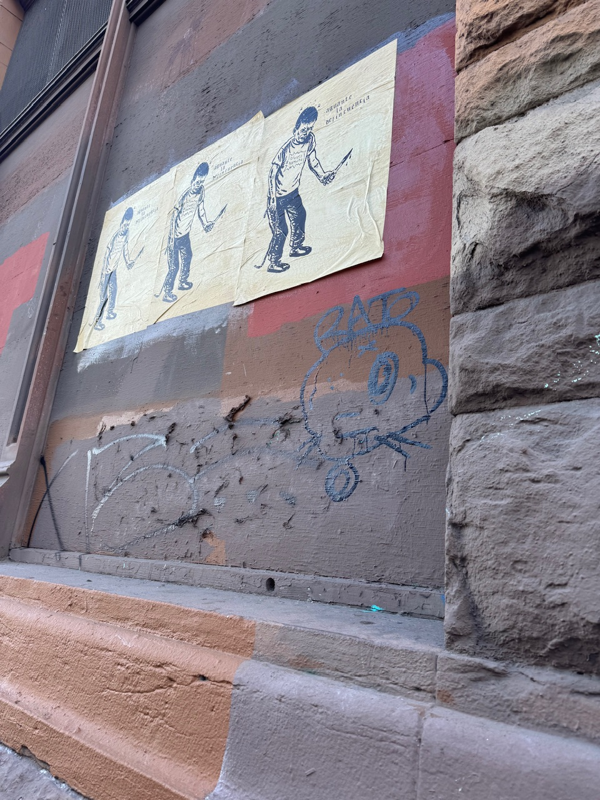

## 「漫步」羅府

在南加住了这么久，很少有机会能在这「天使之城」的市中心散散步。下午三点钟，正是LA最美好的时候——阳光不遗余力地给人注入活力，像是把人带入了一个高饱和度的世界。按理来说，这种午后的休闲，应该很是惬意。

但是，我只感受到了一股股的悲凉。

光照的映衬下，本应生机勃勃，有着烟火气的街道，变得阴沉沉的。小东京里的购物广场，地下室的“小秋叶原”，店铺一个个漆黑一团，为数不多开着的几家店，也门可罗雀。这个地方，我第一次来洛杉矶的时候曾经造访过。永远找不到的停车位，摩肩接踵的人潮，和热闹的小铺子们。现在？阴暗的地下通道里，唯一开着的，是空无一人，但是亮堂堂的扭蛋机广场，和对着空邃的走道，机械般放着开朗活泼声音的大头照机。

小东京的广场里，游客们聚集在网红店，「出片」背景附近，享受着阳光，而在一旁，几个无家可归者推着自己的「交通工具」——从超市顺出来的购物车，在大街上漫步。人行横道边上，小贩在路边上卖着那些本应该在「thrift store」见到的伴手礼，配着边上卖艺的人的，从大喇叭传出来的二胡声。

热闹吗？可能还可以。不过出了游客聚集的两个广场，街上遍布倒闭的门脸，仿佛诉说着一段段回忆。终于「开放堂食」的韩国炸鸡店，本应明亮的玻璃上，是一层又一层的涂鸦。广场里别的商铺，里面挂着2023年活动的海报，大门紧锁。「艺术区」的大楼倒是有一些艺术，不过不在里边，在周围的墙上。

## 阳光的边界

LA变了吗？变了，也没变。一日复一日，南加特有的，火热而明亮的阳光打在这片土地上，照亮着在这里生活的人们的心。但是，我所听到、看到、感受到的一切都在告诉我：人们心中的阴霾，越来越难以被这温暖的阳光所治愈了。

离游客区越远，从小东京走到LA市中心的路上，这份失落和悲伤便变得愈发明显。街边的「简易房」们喋喋不休地讲着「居民」们的故事，而更有人在路边躺着，用力吸收着太阳的温暖。

我稍微冒了下险——去贴着边角，看了看天使之城失落的那个边隅：Skid Row。这里倒是挺有烟火气的，不过我宁可希望没有。大街上的人们，在楼房废墟的阴影下，享受着精神物质带来的刺激；路口旁偷偷交头接耳的两个人，像是在兜售什么东西；而墙上的海报与涂鸦，则在宣扬一些更可怕的东西……

求生的本能驱使我快速离开了那里，我不想让今天变成我人生的最后一天。但是，这些也共同地组成了这个帝国挽歌的一部分。有人知道这里正在发生什么吗？有人能感知到它的衰落，崩溃，和正在散发出的恐怖主义吗？有，至少在象牙塔里，在这自由之城，天使之城的大街上，人们都好像在议论纷纷，抗议的声音此起彼伏，但是这好像也并不能改变什么。每天的新闻越来越抽象，对少数族裔、边缘群体的攻击一天比一天致命。而到最后，真的有人在意吗？好像也没有。

## 丛林社会，和「赢学」

我一直觉得美国是一个巨大的丛林社会，胜者为王，败者为寇。从历史上看，美国创建的这短短几百年中，几乎一直是在以占领、扩张、和掠夺维系的。从殖民地时期开始的，对北美原住民的侵略和恩将仇报，到为了石油进行的掠夺，再到金融场上的一次次「割韭菜」，这个地方一直在吸引着有这样想法的，希望自己也能通过扩张，发展，和掠夺，分到属于自己的那一杯羹的人。但是现在，所有的消息都在告诉我们，现在的世界没有那么多资源去掠夺了。结果就是，这个帝国开始了它的崩塌。

而这个靠着「赢」别人起家的地方的人们，会相信吗？会相信自己现在没有办法去「赢」别人吗？必然不会。所以会有那么多的，我觉得难以置信的声音，将一个纳粹头子选上来，为了给自己发声，为了能让这个集体意志去找一些群体，放上祭台，这样他们就可以继续做他们的「赢学」美梦了。

从某些方面来看，这样的发展，是个必然。但不幸的是，现在首先被放在祭台上的，是移民和跨性别群体，而跨性别移民则首当其冲。很多在美国的人，看到现在的美国，会当那个「理中客」，觉得在历史的漫漫长河之后，这个地方肯定会拨乱反正的。而拨乱反正都需要一些代价。不幸的是，我们，成为了那个代价。

## 对立，真的是对立吗？

从另一方面来看移民这件事，我曾经一度觉得，美国的左派和右派对于移民的意见是完全对立的：一方全力支持，一方全面反对。而现在来看，我觉得这两派人对于移民这个群体的看法，是一致的。他们在从不同方向上，平等且根本性地歧视移民群体。对于这里的左派来说，移民群体等于那些可怜的，弱小的，需要救济的人。让他们来，可以很好地占领道德高地，满足这些人的成就感。而对右派来说，移民群体是可憎的，不学无术的人，来抢工作、蹭福利。把他们打死，自己的饭碗，福利就能保住了。而真实的移民群体的样子，就被湮没在了这些人的对立、吵闹、和宏大叙事之中。无人在意，也无人得知。

而这背后所体现出的，在对立面上的一致性和「赢学」，不只在移民这一个地方上。所谓的男权和一些激女（radfem）的性别斗争，本质上也是在一个一致，自洽的空间进行的。男权说世界必须男尊女卑，而一些人会去说世界必须女尊男卑。看起来他们针锋相对，而他们在核心问题上是很一致的——性别问题上，总得有一个尊，一个卑。总得有一方「赢」过另一方。而真的必须要这样吗？我们在反对男权的时候，真的需要创造出一个完全一致，甚至有些同步的，男权的对立面出来吗？

## 女权和「性别范式」

在小东京的紀伊國屋书店里，我偶然看到了上野千鹤子的「厌女」一书。很久没有在书店里捧着一本书，慢慢地读完了。很多书中所描绘的现实问题振聋发聩，她也谈到了很多女性在现实生活中，尤其是在性方面，和婚恋关系上遇到的种种问题。但是通篇读下来，我的感受是：这本书，或者上野千鹤子本人的女权论调，是建立在由男权所构建的所谓「性别范式」上的。

这本书从最开始，就在默认女性本身，是弱势的那一方。在性能力上，在社会上，在婚恋市场上等等。所以需要搞女权，所以需要让女性「变强」，所以要向上爬，去和更上层的男性结为伴侣。而对于不在性别二元论体系下的人们，她认为，这些人，尤其是跨性别女性倾向者（transfem），都是因为「不够格当男人，从而被男性群体排除开外的存在」

先不谈这本书对于不同性取向者的无视，和对跨性别，以及性别酷儿的无知，这本书所散发出的信息就是，女性本弱，或者说女性在很多方面不如男性。而这一点，恰好是男权社会所构建的性别范式之一。我能理解为什么上野千鹤子会这么想。作为一个20世纪中期出生的人，她对于性别的思考，对于社会问题的研究已经在她所在的年龄段里很通透了。但我不能理解的是，很多所谓「排跨激女」，把这位即将耳顺之年的人的想法当成圣经和进步的法宝，而不想想，为什么一个十几二十的人，要追求和一个76岁的人，在社会议题上想法同步呢？如果在追求进步的道路上，我们都想不断提高自己，让自己变得更好的话，我们何不从自己出发，与别人交流，从而形成自己的思考，并推动自己之后继续的进步呢？

时代要发展，版本要更迭，而其中最重要的不是把谁的想法当成珍宝，而是要从中孕育出自己的精神，那道能支撑自己，走过这段跌宕起伏人生的光。

