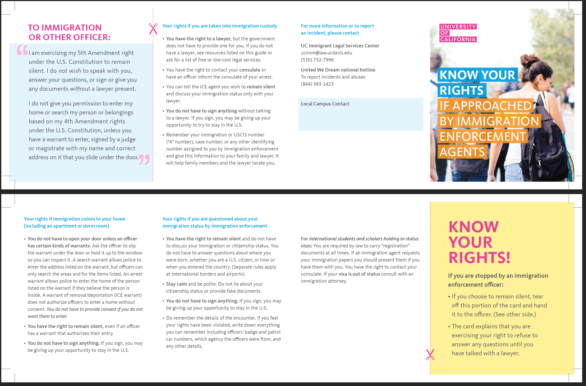

*在这个地方，我想写的绝大多数都是一些对于社会、自然、科学、和文化的思考。但是，不管怎么样，我们都生活在这个世界上。而现在，**如果一个人是现在在美国的中国留学生，那么ta应该提高一些警惕，开始思考一些plan B。**从川普上台开始，尤其是2025年5月开始，现在的美国政府就在积极地攻击所有在美国的移民群体（不论身份的合法性）和美国的高等教育体系。以下是一些人们耳熟能详的历史：*
- *[对哈佛大学的攻击](https://apnews.com/article/harvard-trump-grant-f677055d7536ab1478ee9b836ca11bf7)*
- *[对国际学生随机的签证取消/SEVIS终结](https://apnews.com/article/international-student-visa-f1-sevis-status-716ce8e67e2c3093eba4092e57ba1612)*
- *[对H1-B签证失业期页面的归档](https://instant.1point3acres.cn/thread/1130588)*
- *一直在宣传的[对OPT的取消](https://www.forbes.com/sites/stuartanderson/2025/05/22/snubbing-trump-immigration-nominee-will-end-student-practical-training/)*
- *[全球范围内取消F/M/J类签证的面试](https://www.politico.com/news/2025/05/27/trump-team-orders-stop-to-new-student-visa-interviews-as-it-weighs-expanding-social-media-vetting-00370501)*
- *[对中国留学生签证的取消和审查](https://www.state.gov/releases/office-of-the-spokesperson/2025/05/new-visa-policies-put-america-first-not-china/)*

*本文的目的是为了普及一些在美国的国际学生应该知道的，特别是美国的移民和司法系统相关的法律知识。本文作者不是律师，本文也不构成任何法律建议。本文部分由加州大学[“了解你的权利”卡片](https://www.universityofcalifornia.edu/sites/default/files/2025-01/know-your-rights-card-2025v.pdf)翻译而来。部分文字由ChatGPT生成。*

## 学生签证和SEVIS记录区别

美国学生签证（F/M/J签证）是外国学生来美国读书时必须申请的一种签证。F-1签证只适用于全日制学习（如大学、本科、硕士、高中、语言学校等）。申请前，必须先被美国学校录取。

简单来说，**学生签证（贴在护照上的那张贴纸签证）是一个人以国际学生的身份进入美国的“门票”。**如果这张签证被撤销（revoke），那么这个人将无法凭这张签证从美国的入境口岸“进入”美国。但对于已经在美国的人来说，签证被撤销并不代表这个人在美国合法居留身份的消失。

SEVIS记录（学生和交流访问者信息系统）是美国政府用来管理国际学生和交流访问者的系统。每个留学生都会在这个系统中有一个记录。学生的信息（如学校、课程、签证状态）都会在里面更新。

**SEVIS记录相当于是国际学生在美国合法居留身份的来源。**任何国际学生都必须保持SEVIS正常有效，才可以在美国合法居留。如果一个人的SEVIS记录被终止（terminate），那么这个人将必须在24小时之内离开美国，并重新入境激活SEVIS记录。

## “Revoke F-1 visa”或“terminate SEVIS record”之后会发生什么？

如果一个人仅只是F-1签证被撤销（revoke），那么这个人离开美国领土（美国50州+波多黎各+USVI+关岛/CNMI）之后，将必须向美国的驻外使领馆重新申请签证才能进来。

如果一个人的SEVIS记录被终止，那么这个人必须在24小时之内离开美国，否则就会冒在美国非法居留的风险。

## 如果你人在美国， 但是SEVIS记录被终结了应该怎么做？

首先，你应该找一个移民律师进行咨询，并且商讨可能的路线。一种可行的路线是去**起诉联邦政府终结SEVIS记录的行为违法**。在美国的联邦地区法院正式判决下达之前，法官有权利颁发临时限制令（Temporary Restraint Order）或者初步禁令（Preliminary Injunction）来阻止联邦行政机构的一些行为。但是如果法官最终判决联邦政府获胜，那么从SEVIS记录被终结一直到判决下达的所有时间都会被视为非法居留。另一种比较稳妥的做法是在24小时之内离开美国。

## 如果你被关进了移民监狱里

- **你有权聘请律师**，但政府没有义务为你提供律师。
- 如果你没有律师，可以参考本指南中列出的资源，或要求提供一份免费的或低收费法律服务的名单。
- 你有权联系你的领事馆，或要求执法人员通知领事馆你被逮捕的情况。
- 你可以告诉移民执法官你希望保持沉默，只与你的律师讨论你的移民身份问题。
- 在未与律师交谈前，你没有义务签署任何文件。签字可能意味着你放弃了留在美国的机会。
- 请记住你的移民或美国移民局编号（即“A-number”）、案件编号，或移民执法机构分配给你的任何其他识别号码（如有），并将这些信息提供给你的家人和律师。这样他们才能更容易找到你。

## 如果移民执法局（ICE）来到了你家门口

- **除非执法人员持有特定类型的搜查令，否则你没有义务开门。**
- 你可以要求执法人员将搜查令从门缝塞进来，或在窗户前举起让你查看。
- 搜查令（Search Warrant）允许警察进入搜查令上所写的地址，但他们只能搜查文件中列明的区域和物品。
- 逮捕令（Arrest Warrant）允许警察进入令状上所写那个人的住处，但前提是他们相信那个人当时在屋内。
- 遣返令/驱逐令（ICE签发的Removal/Deportation Warrant）不授权执法人员在没有你同意的情况下进入住宅。如果你不愿意让他们进入，你有权拒绝。
- 即使执法人员持有允许进入的搜查令，你仍然有权保持沉默。
- 你没有义务签署任何文件。如果你签了，可能就放弃了留在美国的机会。

## 如果移民执法局的人想要进入你的家门

请将下面这段话打印在一张纸上，并把这张纸给移民执法局的人看（请切记不要交出自己的手机或其他电子设备）。

> I am exercising my 5th Amendment right under the U.S. Constitution to remain silent. I do not wish to speak with you, answer your questions, or sign or give you any documents without a lawyer present. 
> I do not give you permission to enter my home or search my person or belongings based on my 4th Amendment rights under the U.S. Constitution, unless you have a warrant to enter, signed by a judge or magistrate with my name and correct address on it that you slide under the door. 

## 如果移民执法局的人询问你的移民身份

- **你有权保持沉默，不需要讨论你的移民或公民身份。**
- 你没有义务回答有关你出生地点、是否是美国公民，或你是如何/何时进入美国的问题。（在国际边境和机场有不同的规定。）
- 保持冷静并礼貌对待。不要谎报你的公民身份，也不要提供虚假文件。
- 你没有义务签署任何文件。如果你签字，可能会放弃你留在美国的机会。
- 请记住整个接触过程的细节。如果你认为自己的权利被侵犯，请尽可能记下所有能回忆的内容，包括执法人员的徽章号码和巡逻车编号，他们所属的执法机构，以及其他任何相关信息

## 针对有有效身份的国际学生

法律规定所有人必须**随时**持有“有效登记证件”（对于F-1学生来说，有效登记证件为I-20和I-94）。如果移民执法局的人要求查看你的登记证件，你应该提供给这些人看，但是你也有权寻求律师的帮助。

## 结语

在如今的社会环境和政治风波中，希望大家，尤其是跨儿们能够坚强，能够在明哲保身的基础上，保留着自己内心的那一点灯火，等待着适当的时机，使其燎原。

